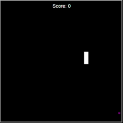

# 🚀 Days 20 and 21 - Instances, State and Higher Order Functions
100 Days of Code - Python Bootcamp (Days 20 and 21)

This repository contains **Days 20 and 21** code of the [100 Days of Code: The Complete Python Pro Bootcamp](https://www.udemy.com/course/100-days-of-code/?couponCode=KEEPLEARNINGBR) course by Angela Yu on Udemy.

### Key Concepts Covered:
- Animating using turtle module
- OOP
- How to control the snake using the keyboard

### The Snake Game
The challenge was to recreate the snake game. Using turtle module.
When it colides with a food, you score 1 point, when coliding with the wall or with its tails, th egame is over.

